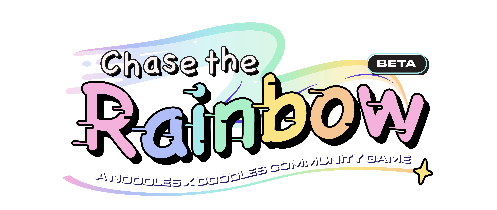

---
# 🎮 Project purpose

> At the beginning of February, the Noodles and Doodles team imagined a world where Space Doodles and Noodles could come together and play and interact with each other and their own beloved NFTs.
> 
> Ultimately, a Noodle and Doodle community driven project created to further the Space wrapping experience was created. By incentivizing communities to play, compete, and contribute to this project, the teams hope to strengthen bonds while rewarding the communities for their creative and community initiatives.

**Read more about the project on [the project notion](https://space-noodles-doc.notion.site/Noodles-x-Doodles-Community-Presents-Chase-the-Rainbow-53906b47f7e14ce1b3964458fbc5a7f8).**

# 🔧 Usage and Development (Local)
### Pre-Requisites
💡 Before you begin, make sure you have the following installed:
- [Node.js](https://nodejs.org) 
- [Git](https://git-scm.com/book/en/v2/Getting-Started-Installing-Git/)

### Available Commands
| Command | Description |
|---------|-------------|
| `npm install` | Install project dependencies |
| `npm run watch-dev` | Build project and open web server running project |
| `npm run build` | Builds code bundle with production settings (minification, uglification, etc..) |
| `node src/server/server.js` | Starts server at `http://localhost:3000` |

### Getting Started
1. Execute the following commands in the project root folder:
```jsx
npm install
```
This will install all the required dependencies to initialize all the packages on a local development environment

2. Execute the following commands in the project root folder:

```jsx
npm run watch-dev
```

3.  Execute the following commands in the project root folder in another terminal:

```jsx
node src/server/server.js
```
4. Turn off production mode in mainMap.js
```jsx
 this.prodMode = false;
```

5. (optional) In order to run CTR locally without doodles/noodles in your wallet, turn on mock nft data in app.js
```jsx
 const mockNfts = true;
```
# 👨‍💻 Tech stack

Here's a brief high-level overview of the tech stack the CTR game uses:

- This project uses [Phaser 3](https://phaser.io/phaser3). Phaser 3 is a Desktop and Mobile HTML5 game framework which we use as our 2D rendering engine to power our web browser game.
- For persistent storage (database), the app uses [MongoDB](https://www.mongodb.com/docs/) which allows the the app to save gameplay records for us to parse and display on the leaderboard. The app also uses session storage to persist data locally from page to page.
- The front-end portion of this app uses [React](https://reactjs.org/) alongside including ES6 support via [Babel 7](https://babeljs.io/) and [Webpack 4](https://webpack.js.org/) that includes hot-reloading for development and production-ready builds.


# ✍️ Contributing

>While the Noodles team laid the foundation for this project, we understand there are plenty of other features that can be implemented to enhance the community’s vision for this project. We encourage everybody to get involved and make contributions and suggestions, whether developers, artists, designers, lore creators, anybody!

1. **Report a bug** 
 If you think you have encountered a bug, and we should know about it, feel free to report it [here](https://discord.gg/noodles-nft) and we will take care of it.

 2. **Request a feature** 
 You can also request for a feature [here](https://discord.gg/noodles-nft), and if it will viable, it will be picked for development.  

 3. **Create a pull request** 
 It can't get better then this, your pull request will be appreciated by the community. You can get started by picking up any open issues from [here](https://discord.gg/noodles-nft) and make a pull request.

 If you are new to open-source, make sure to check read more about it [here](https://www.digitalocean.com/community/tutorial_series/an-introduction-to-open-source) and learn more about creating a pull request [here](https://www.digitalocean.com/community/tutorials/how-to-create-a-pull-request-on-github).
 
### Feature Contributions/ Pull Requests

**Steps to work with feature branch**

1. Fork and clone this repository to your machine.
2. To start working on a new feature, create a new branch prefixed with `feat` and followed by feature name. (ie. `feat-FEATURE-NAME`)
2. Once you are done with your changes, you can raise PR.

A more detailed guide can be found [here](https://github.com/firstcontributions/first-contributions)

**Steps to create a pull request**

1. Make a PR to `main` branch.
2. Comply with the best practices and guidelines e.g. where the PR concerns visual elements it should have an image showing the effect.
3. Once the PR is reviewed and approved by the team, we will test the changes in a staging environment.

After this, changes will be merged.

# 📷 Gallery


https://user-images.githubusercontent.com/68214127/195008892-89a9472b-f88e-45ad-9f3d-422f8ca71ce4.mp4


